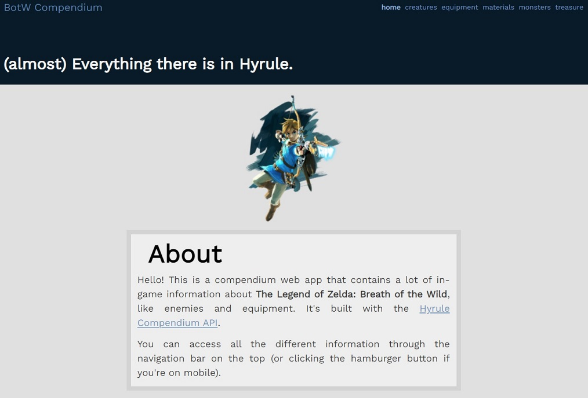
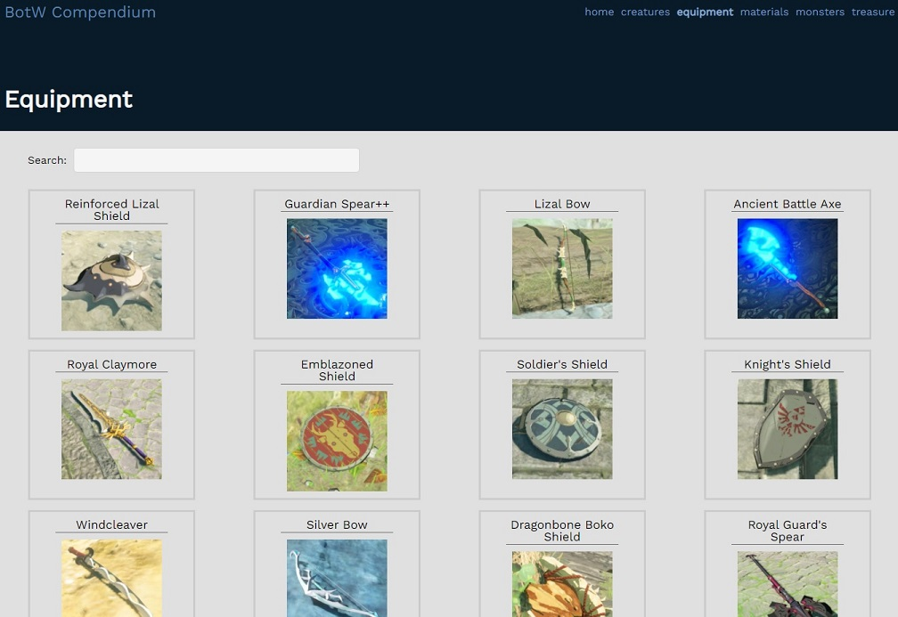

# Breath of the Wild Compendium

<a href="https://botw-compendium.vercel.app/">Demo</a>

"BotW Compendium" is web app that contains a lot of in-game information about The Legend of Zelda: Breath of the Wild. Built with Vue.js, using the <a class="footer__link" href="https://github.com/gadhagod/Hyrule-Compendium-API" target="_blank">Hyrule Compendium API</a>.

# Homepage

## The other pages
You can navigate through the tabs to look for the information you're seeking. It's organized in sections:
<ul>
    <li>Creatures</li>
    <li>Equipment</li>
    <li>Materials</li>
    <li>Monsters</li>
    <li>Treasure</li>
</ul>

# Equipment section

